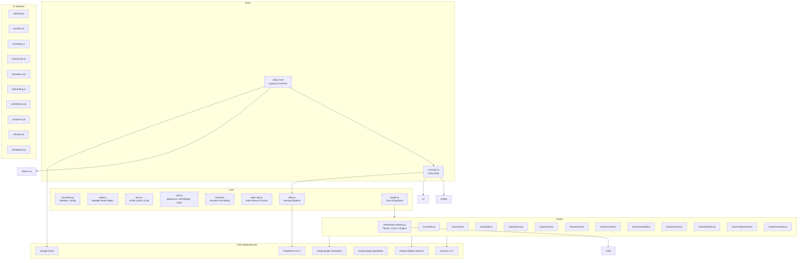
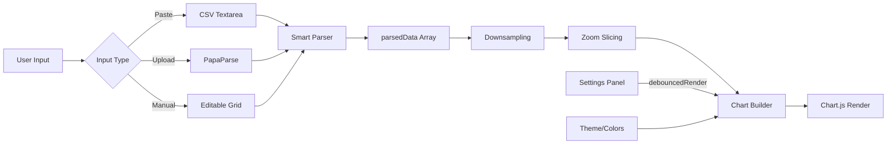
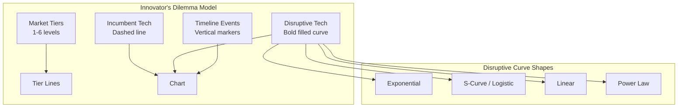
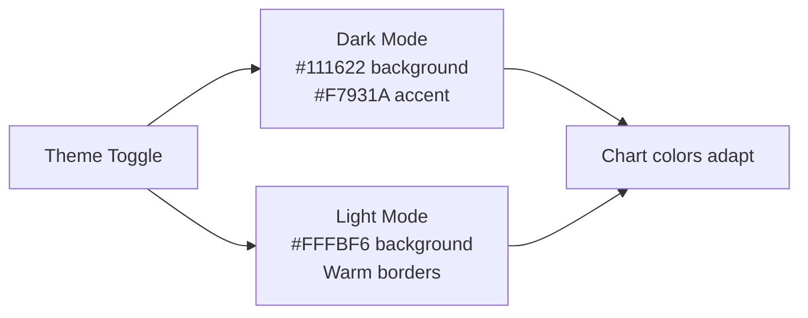

# Simple Charts

A browser-based, publication-quality chart creation tool designed for producing branded charts optimized for social media. Runs entirely client-side with zero build steps.

## Table of Contents

- [Overview](#overview)
- [Getting Started](#getting-started)
- [Architecture](#architecture)
- [Chart Types](#chart-types)
- [Features](#features)
  - [Data Input](#data-input)
  - [Style & Display](#style--display)
  - [Formatting](#formatting)
  - [Annotations](#annotations)
  - [Colors & Theming](#colors--theming)
  - [Branding & Watermark](#branding--watermark)
  - [Zoom & Pan](#zoom--pan)
  - [Dual Y-Axis](#dual-y-axis)
  - [Timeline Events](#timeline-events)
  - [Innovator's Dilemma](#innovators-dilemma)
  - [Segmented Bar Chart](#segmented-bar-chart)
  - [Export & Sharing](#export--sharing)
  - [Keyboard Shortcuts](#keyboard-shortcuts)
- [Dependencies](#dependencies)
- [Data Handling](#data-handling)
- [Project Structure](#project-structure)

---

## Overview

Simple Charts lets you paste, upload, or manually enter data and instantly generate polished, branded charts. It supports 13 chart types, dark/light themes, social-media-optimized export sizes, and advanced features like dual axes, timeline event markers, a segmented bar chart editor, and a unique "Innovator's Dilemma" visualization.

```
┌─────────────────────────────────────────────────────────────────┐
│  Simple Charts                              [Theme] [Export]    │
├──────────┬──────────────────────────────┬───────────────────────┤
│          │                              │                       │
│ Settings │       Chart Preview          │     Data Input        │
│  Panel   │                              │      Panel            │
│          │                              │                       │
│ - Type   │    ┌──────────────────┐      │  [Paste] [CSV] [Manual│
│ - Labels │    │                  │      │                       │
│ - Style  │    │   Rendered Chart │      │  Label, Value         │
│ - Format │    │                  │      │  Jan,   120           │
│ - Colors │    │                  │      │  Feb,   245           │
│ - Export │    └──────────────────┘      │  Mar,   180           │
│          │                              │                       │
├──────────┴──────────────────────────────┴───────────────────────┤
│  Source: ...                                                     │
└─────────────────────────────────────────────────────────────────┘
```

---

## Getting Started

### Prerequisites

A modern browser (Chrome, Firefox, Safari, Edge). No installation, no build tools, no server required.

### Run

ES modules require an HTTP server (they won't work over `file://`). Use any local server:

```bash
# Clone the repository
git clone <repo-url>
cd graphs

# Option 1: Python
python3 -m http.server 8080

# Option 2: Node.js (npx)
npx serve .

# Option 3: PHP
php -S localhost:8080
```

Then open `http://localhost:8080` in your browser. All dependencies load via CDN.

### Quick Start

1. **Choose a chart type** from the grid at the top of the left panel
2. **Enter data** in the right panel — paste CSV text, upload a `.csv` file, or use manual entry
3. **Customize** using the settings panels (labels, style, colors, formatting)
4. **Export** using the download button or `Cmd/Ctrl + E`

### Global Paste

Pasting data anywhere on the page (when not focused on an input) automatically populates the data textarea and parses it. Just copy your spreadsheet data and paste.

---

## Architecture

ES module architecture — no build tools, no bundler. Each module has a single responsibility.



### Data Flow



---

## Chart Types

### Line Chart
Standard line chart with optional curve tension and area fill. Best for showing trends over time or continuous data.

**When to use:** Time-series data, trend analysis, comparing multiple series over a continuous axis.

### Timeline
A line chart enhanced with vertical event markers. Events appear as dashed vertical lines with labels, highlighting key moments alongside the data trend.

**When to use:** Showing historical events alongside quantitative data (e.g., stock price with company milestones, crypto prices with regulatory events).

### Vertical Bar
Classic column chart with configurable border radius. Bars auto-limit to 30 for readability.

**When to use:** Comparing discrete categories, showing magnitude differences.

### Horizontal Bar
Bars run horizontally. Useful when category labels are long and need readable text.

**When to use:** Ranking data, survey results, category comparisons with long labels.

### Pie Chart
Pie chart with automatic aggregation of small slices into an "Other" category (max 12 slices). Best for showing proportions.

**When to use:** Market share, budget breakdown, any part-of-whole data.

### Donut Chart
A pie chart with a 62% center cutout, supporting up to 10 labeled segments. The hollow center can draw attention to a summary metric.

**When to use:** Distribution data where you want a modern, less dense look than a pie chart.

### Area (Stacked)
Stacked area chart where multiple series layer on top of each other, showing both individual contribution and cumulative total.

**When to use:** Composition over time (e.g., revenue by product line, traffic by source).

### Radar / Spider
Multi-axis radar chart comparing several metrics at once. Each axis represents a different dimension.

**When to use:** Multi-attribute comparison (e.g., skill assessments, product feature matrices).

### Scatter Plot
Plots individual data points on X/Y axes. X values are auto-derived from labels or row indices.

**When to use:** Correlation analysis, distribution of data points, identifying outliers.

### Waterfall
Shows incremental positive (green) and negative (red) changes, ending with a cumulative total bar in the brand color. Ideal for financial analysis.

**When to use:** Profit/loss breakdowns, variance analysis, step-by-step contributions to a total.

### Innovator's Dilemma
A specialized visualization of Clayton Christensen's theory of disruptive innovation. Renders parametric curves instead of user data — showing how incumbent and disruptive technologies evolve over time against market tier expectations.

**When to use:** Business strategy presentations, innovation theory illustration, educational contexts.



### Segmented Bar Chart

A single bar divided into colored segments showing proportions or values. Supports both normalized (100%) and raw-value (unit) modes with a dedicated in-panel segment editor.

**When to use:** Market share breakdown, budget allocation, survey results, any part-of-whole comparison where a single stacked bar communicates the composition.

| Setting | Options | Description |
|---|---|---|
| Mode | 100% (Normalized) / Unit (Actual Values) | Show percentages or raw numbers |
| Orientation | Horizontal / Vertical | Bar direction |
| Bar Thickness | 0.1 – 1.0 | Height/width ratio of the bar |
| Border Radius | 0 – 16 | Corner rounding on outer edges |
| Segment Gap | 0 – 8 | Visual spacing between segments |
| Show Data Labels | On/Off | Display values on each segment |
| Show Percentages | On/Off | Display percentage on each segment |

**Segment Editor:** Each segment has a color picker, label input, value number input, and range slider — all synced for live editing. Add or remove segments dynamically. Data can also be loaded from CSV/JSON/clipboard via the standard data input panel.

---

## Features

### Data Input

Three input modes accessible via tabs in the right panel:

| Mode | How It Works | Best For |
|---|---|---|
| **Paste** | Paste CSV-formatted text into a textarea | Quick data from spreadsheets |
| **CSV Upload** | Drag-and-drop or browse for `.csv`/`.tsv` files | Large datasets, exported files |
| **Manual Entry** | Editable spreadsheet-like grid with dynamic series/rows | Building data from scratch |

**Supported data formats:**
```
Label, Value
Label, Series1, Series2, Series3
```

**Smart number parsing** handles:
- K/M/B suffixes: `1.5M` → `1,500,000`
- Parenthetical negatives: `(100)` → `-100`
- Currency symbols and percentage signs
- Auto header detection (checks if second column is non-numeric)

### Style & Display

| Setting | Options | Description |
|---|---|---|
| Line Tension | 0 – 0.5 | Curve smoothness (0 = angular, 0.5 = very smooth) |
| Point Size | 0 – 8 | Data point marker size |
| Line Width | 1 – 5 | Stroke thickness |
| Show Legend | On/Off | Toggle the legend box |
| Show Grid | On/Off | Toggle gridlines |
| Data Labels | On/Off | Show values directly on data points |
| Fill Under Line | On/Off | Semi-transparent area fill |
| Bridge Missing Data | On/Off | Connect across null/empty values |
| Grid Style | Solid / Dashed / Dotted / None | Gridline appearance |
| Border Radius | 0 – 12 | Bar chart corner rounding |
| Legend Position | Top / Bottom / Left / Right | Where the legend appears |
| Tooltip Style | Default / Compact / Detailed | Hover tooltip formatting |
| Animation Speed | None / Fast / Normal / Slow | Chart render animation |

### Formatting

| Setting | Options | Description |
|---|---|---|
| X-Axis Type | Auto / Category / Date/Time / Linear | How the X-axis interprets data |
| Number Format | Auto / Raw / Commas / Short / Currency / Percentage | Y-axis and tooltip number display |
| Date Format | Auto / Year / Mon Year / Mon YY / MM/YYYY / Month | Date label appearance |
| Y-Axis Scale | Linear / Logarithmic | Axis scaling mode |
| Y-Axis Min/Max | Numeric | Manual axis bounds |
| Max Axis Labels | 4 – 30 | Tick density control |
| X-Axis Rotation | 0° – 90° | Label angle |
| Decimal Places | Auto / 0 / 1 / 2 / 3 | Precision control |
| Currency Symbol | Text (default `$`) | Prefix for currency format |

### Annotations

**Reference Line** — Draw a horizontal dashed line at a specified Y value with an optional label. Useful for highlighting targets, averages, or thresholds.

### Colors & Theming

#### Theme System



#### Preset Palettes

| Palette | Colors |
|---|---|
| Default | Orange, Blue, Green, Pink, Purple |
| Warm | Amber, Red, Orange, Pink, Dark Amber |
| Cool | Blue, Cyan, Violet, Teal, Indigo |
| Neon | Green, Magenta, Yellow, Blue, Purple |
| Pastel | Light Red, Light Blue, Light Green, Light Yellow, Light Purple |
| Monochrome | White, Light Gray, Gray, Dark Gray, Slate |

#### Custom Colors
- 5 individual color pickers with hex input (bidirectional sync)
- Custom chart background color
- Custom grid color
- "Reset to Brand" button restores theme defaults
- Semantic colors for waterfall charts (green = positive, red = negative)

### Branding & Watermark

Add a brand name and/or logo to exported charts:

- **Brand Name** — rendered as small bold text
- **Brand Logo** — upload an image file **or** paste raw SVG code
  - **File upload** — select an image from disk (PNG, JPG, SVG, etc.)
  - **SVG Code** — paste SVG markup directly; includes basic sanitization (strips `<script>` tags and inline event handlers)
- **Position** — which corner the brand group anchors to: Bottom Right, Bottom Left, Top Right, Top Left
- **Logo Placement** — where the logo sits relative to the brand name:
  - Left — logo to the left of the name (default)
  - Right — logo to the right of the name
  - Above — logo centered above the name
  - Below — logo centered below the name
- **Opacity** — 0.2 to 1.0 (default 0.7)

Logo and name are vertically centered when side-by-side and horizontally centered when stacked.

### Zoom & Pan

A dual-handle range slider appears for line, timeline, area, and innovator charts when data exceeds 50 points:

- Drag handles to select a visible sub-range
- Start/end labels show the current range
- Reset button returns to full view
- Zoom is applied before rendering for smooth preview

### Dual Y-Axis

Automatically available when data has 2+ series on axis-based chart types:

- Toggle to enable/disable
- Assign each series to Left Y, Right Y, or Hidden
- Custom names for both axes
- Right axis renders with independent scale, grid hidden to avoid clutter

### Timeline Events

Available for Timeline and Innovator chart types:

- **Manual mode** — add events one by one with date + label
- **Bulk mode** — paste multiple events as `date, event name` lines
- Events render as vertical dashed lines with labels
- Auto-wrapped text (18 chars max, 3 lines)
- Overlapping events are stacked with vertical offset
- Smart date matching with 30-day proximity threshold

### Innovator's Dilemma

A parametric chart that generates curves from configuration rather than user data:

| Parameter | Range | Description |
|---|---|---|
| Market Tiers | 1 – 6 | Number of sustaining innovation tiers |
| Tier Names | Custom text | Labels for each market tier |
| Market Tier Top/Bottom | Y-axis range | Vertical extent of tier bands |
| Sustaining Innovation Pace | 0.2 – 3.0 | Slope of incumbent improvement lines |
| Incumbent Technology | Toggle | Show/hide the dashed incumbent line |
| Incumbent Base Level | 20 – 120 | Starting Y value |
| Incumbent Slope | 0 – 40 | Rise over the full X range |
| Disruptive Technology | Toggle | Show/hide the bold disruptive curve |
| Disruption Pace | 0.3 – 6.0 | How quickly the disruption grows |
| Disruptive Start/Peak | Range | Y-axis bounds for the disruption curve |
| Curve Shape | Exponential / S-Curve / Linear / Power Law | Mathematical model for the disruption |
| Time Axis Mode | Abstract / Year Range / Month Range | How the X-axis is labeled |

### Export & Sharing

#### Formats
| Format | Description |
|---|---|
| PNG | Rasterized export (default) |
| JPG | JPEG at 0.95 quality |
| SVG | PNG wrapped in an SVG container |
| WebP | WebP format |

#### Preset Sizes
| Platform | Dimensions |
|---|---|
| Twitter/X | 1200 x 675 |
| Instagram | 1080 x 1080 |
| LinkedIn | 1200 x 627 |
| General | 1200 x 900 |

#### Quality
1x, **2x** (default), 3x — multiplies pixel dimensions for retina-quality exports. Font sizes scale proportionally.

#### Copy Options
- **Copy to Clipboard** — PNG image blob via `navigator.clipboard.write`
- **Copy as JSON** — structured JSON with chart config, data, colors, and theme

#### Export Modal
- Auto-generates filename from dataset names, subtitle, or title
- Date-stamped filenames
- Keyboard: Enter to confirm, Escape to cancel

### Keyboard Shortcuts

| Shortcut | Action |
|---|---|
| `Cmd/Ctrl + E` | Export chart |
| `Cmd/Ctrl + Shift + D` | Toggle dark/light theme |
| `Cmd/Ctrl + C` | Copy to clipboard (when no text selected) |

---

## Dependencies

All loaded via CDN — no npm, no bundler.

| Library | Version | Purpose |
|---|---|---|
| [Chart.js](https://www.chartjs.org/) | 4.4.7 | Core chart rendering engine |
| [chartjs-adapter-date-fns](https://github.com/chartjs/chartjs-adapter-date-fns) | 3.0.0 | Date/time axis support |
| [chartjs-plugin-annotation](https://github.com/chartjs/chartjs-plugin-annotation) | 3.1.0 | Reference lines and event markers |
| [chartjs-plugin-datalabels](https://github.com/chartjs/chartjs-plugin-datalabels) | 2.2.0 | Custom data labels |
| [PapaParse](https://www.papaparse.com/) | 5.4.1 | CSV parsing with web workers |
| Google Fonts | — | Inter (300–700) + JetBrains Mono (400–500) |

---

## Data Handling

### Size Limits

| Threshold | Behavior |
|---|---|
| 500+ points | Auto-downsample to monthly |
| 2,000+ points | Auto-downsample to quarterly |
| 10,000 rows | Warning shown |
| 50,000 rows | Hard limit (configurable via Max Rows input) |
| 30 bars | Maximum for bar charts |
| 12 / 10 slices | Maximum for pie / donut charts |

### Downsampling Options

Auto, None, Weekly, Monthly, Quarterly, Yearly — applied as averaging buckets over time-series data.

### Time Series Detection

Auto-detects date columns by testing the first 20 values against patterns:
- `YYYY-MM-DD`, `MM/DD/YYYY`, `DD/MM/YYYY`
- `Jan 2024`, `Jan 15, 2024`, `YYYY-MM`

Data is auto-sorted chronologically with an appropriate date display format selected based on the date range span.

---

## Project Structure

```
graphs/
├── index.html              # HTML layout, 3-column structure, all controls
├── styles.css              # Themes, design tokens, responsive layout
├── src/
│   ├── main.js             # Entry point: imports all modules, calls init()
│   ├── render.js           # Chart render dispatcher (routes to chart builders)
│   ├── constants.js        # PALETTE, DEFAULT_COLORS, PRESET_PALETTES, CONFIG
│   ├── state.js            # Single mutable state object
│   ├── dom.js              # DOM cache ($, $$, dom object)
│   ├── utils.js            # debounce, safeInt, safeFloat, hexToRgba, showToast
│   ├── format.js           # formatNumber (6 modes)
│   ├── date-utils.js       # tryParseDate, isDateColumn, formatDateLabel
│   ├── data.js             # Parsing pipeline: CSV, JSON, manual, downsample, zoom
│   ├── format-number.js    # Y-tick, data-label, tooltip formatters
│   ├── charts/
│   │   ├── base-options.js # getThemeColors, getMultiColors, bgPlugin, sourceFooterPlugin, brandPlugin
│   │   ├── line.js         # Line chart builder
│   │   ├── bar.js          # Vertical & horizontal bar chart builder
│   │   ├── pie.js          # Pie chart builder
│   │   ├── donut.js        # Donut chart builder
│   │   ├── area.js         # Stacked area chart builder
│   │   ├── radar.js        # Radar/spider chart builder
│   │   ├── scatter.js      # Scatter plot builder
│   │   ├── waterfall.js    # Waterfall chart builder
│   │   ├── combo.js        # Combo (mixed) chart builder
│   │   ├── timeline.js     # Timeline chart builder (with event markers)
│   │   ├── segmented.js    # Segmented bar chart builder + segment editor
│   │   └── innovator.js    # Innovator's Dilemma parametric chart builder
│   └── ui/
│       ├── theme.js        # Dark/light theme toggle
│       ├── colors.js       # Color pickers, preset palette listeners
│       ├── settings.js     # Chart type grid, settings panel visibility
│       ├── dual-axis.js    # Dual Y-axis assignment UI
│       ├── combo-ui.js     # Combo chart dataset type selector
│       ├── branding.js     # Logo upload/clear, brand settings
│       ├── timeline-ui.js  # Timeline event editor UI
│       ├── zoom-ui.js      # Zoom slider controls
│       ├── export.js       # Export modal: PNG, JPG, SVG, WebP
│       └── clipboard.js    # Paste handler, keyboard shortcuts (Cmd+E/C/Shift+D)
└── *.csv                   # Sample datasets
```

### Module Dependency Flow

```
main.js
 ├── state.js ← constants.js
 ├── dom.js
 ├── utils.js
 ├── render.js ← all charts/*
 │                ← charts/base-options.js ← state.js, dom.js
 │                ← data.js ← state.js, dom.js, utils.js, date-utils.js
 ├── ui/theme.js ← state.js, dom.js
 ├── ui/colors.js ← state.js, dom.js, constants.js
 ├── ui/settings.js ← state.js, dom.js, render.js
 ├── ui/dual-axis.js ← state.js, dom.js, render.js
 ├── ui/combo-ui.js ← state.js, dom.js, render.js
 ├── ui/branding.js ← state.js, dom.js, render.js
 ├── ui/timeline-ui.js ← state.js, dom.js, render.js
 ├── ui/zoom-ui.js ← state.js, dom.js, data.js, render.js
 ├── ui/export.js ← state.js, dom.js
 └── ui/clipboard.js ← state.js, dom.js, data.js
```

### Key Design Decisions

- **Shared mutable state** — All runtime state lives in a single `state` object exported from `state.js`. Any module can import and read/write it.
- **CDN globals** — `Chart`, `ChartDataLabels`, `Papa` remain as `window` globals. No npm required.
- **Window bridges** — `window.__renderChart`, `window.__debouncedRender`, `window.__updateAfterDataLoad` avoid circular imports between `main.js` and UI modules.
- **No circular dependencies** — The module graph is a clean DAG (directed acyclic graph).
